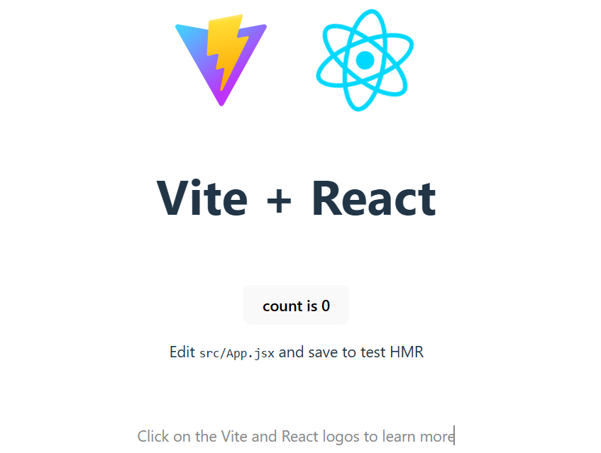

Projekt AI-IMAGE_GEN

Folgende Anweisungen

``` bash
# 1. Erstelle ein neues Vite Projekt namens "ai-image-gen"
npm create vite@latest ai-image-gen -- --template react

# 2. Gehe in den Ordner
cd ai-image-gen

# 3. Installiere die Abhängigkeiten
npm install
``` 

sehen im Terminal cmd so aus

``` bash
npm install
c:\dev>npm create vite@latest ai-image-gen -- --template react
Need to install the following packages:
create-vite@8.2.0
Ok to proceed? (y) y


> npx
> create-vite ai-image-gen --template react

|
o  Use rolldown-vite (Experimental)?:
|  No
|
o  Install with npm and start now?
|  No
|
o  Scaffolding project in c:\dev\ai-image-gen...
|
—  Done. Now run:

  cd ai-image-gen
  npm install
  npm run dev


c:\dev>cd ai-image-gen

c:\dev\ai-image-gen>dir
 Datenträger in Laufwerk C: ist Windows
 Volumeseriennummer: 5E6C-7A7C

 Verzeichnis von c:\dev\ai-image-gen

17.12.2025  09:46    <DIR>          .
17.12.2025  09:46    <DIR>          ..
17.12.2025  09:45               253 .gitignore
17.12.2025  09:45               758 eslint.config.js
17.12.2025  09:46               361 index.html
17.12.2025  09:46               608 package.json
17.12.2025  09:46    <DIR>          public
17.12.2025  09:45             1.157 README.md
17.12.2025  09:46    <DIR>          src
17.12.2025  09:45               161 vite.config.js
               6 Datei(en),          3.298 Bytes
               4 Verzeichnis(se), 787.773.992.960 Bytes frei

c:\dev\ai-image-gen>npm install

added 203 packages, and audited 204 packages in 9s

33 packages are looking for funding
  run `npm fund` for details

found 0 vulnerabilities

c:\dev\ai-image-gen>npm run dev

> ai-image-gen@0.0.0 dev
> vite


  VITE v7.3.0  ready in 550 ms

  ➜  Local:   http://localhost:5173/
  ➜  Network: use --host to expose
  ➜  press h + enter to show help

  ```



Dieser screenshot gibt den Inhalt der aktuellen src/App.jsx wieder. Während das Styling dieses screenshots in src/App.css steht. Beide Dateien werden nun ersetzt, um die gewünschte App zu erstellen.

### Code einfügen
Öffne die Datei src/App.jsx in deinem Code-Editor und ersetze den gesamten Inhalt durch folgenden Code. (Hier wird der Code eingefügt.) 

Dies ist die komplette Logik der App. Sie beinhaltet die Definition der Auflösungen, die Zustandsverwaltung (Laden, URL, Auswahl) und die UI-Elemente.

Öffne die Datei src/App.css und ersetze den Inhalt durch dieses CSS, damit es modern aussieht: (Hier wird der CSS eingefügt.)

### Test 
Gehe zurück ins Terminal und starte den Entwicklungsserver:

`npm run dev`

Öffne die angezeigte URL (meist http://localhost:5173) in deinem Browser. Du solltest jetzt deine funktionierende App sehen! Teste sie mit einem Prompt.

### Bauen und auf den Webspace hochladen (Deploy)
Wenn alles funktioniert, bauen wir die finale Version für deinen Webserver.

Führe im Terminal aus:
`npm run build`

Dieser Befehl erstellt einen neuen Ordner namens `dist` in deinem Projektverzeichnis.

Der Inhalt dieses dist-Ordners ist deine fertige App (HTML, CSS, JS Dateien).

Lade nur den Inhalt des dist-Ordners per FTP auf deinen Webspace (z.B. in das public_html oder oder httpdocs Verzeichnis).

Du brauchst kein `Node.js` auf deinem Server. Die App läuft jetzt auf jedem normalen Webhosting.

### Qualität
Das ist der wichtigste Hebel, um aus der Demo-App wirklich beeindruckende Ergebnisse herauszuholen. In der aktuellen kostenlosen API von Pollinations gibt es ein paar Parameter, die man in der URL im App.jsx anpassen kann.

Hier sind die drei Ansätze zur Qualitätssteigerung und wo genau du sie im Code einbaust:

1. Das Modell wechseln (model=...)
In der Zeile, in der finalUrl definiert wird, kannst du verschiedene Modelle ausprobieren. Pollinations bietet Zugriff auf unterschiedliche Backends:

`model=flux`: (Aktuell Standard) Schnell, gute Anatomie, mittlere Schärfe.

`model=flux-realism`: Speziell auf fotorealistische Texturen getrimmt.

`model=flux-pro`: Versucht (wenn Kapazität frei ist) das hochwertigste Flux-Modell anzusprechen.

`model=any`: Würfelt oft ein Modell zusammen, kann aber manchmal überraschend gute Stable Diffusion XL Ergebnisse liefern.

Wo im Code? (in `App.jsx` innerhalb der `handleGenerate` Funktion):

// Ändere diesen Teil in der URL:
```bash
const finalUrl = `https://pollinations.ai/p/${fullPrompt}?width=${width}&height=${height}&seed=${seed}&model=flux-realism&nologo=true`;
```
Den "Secret Sauce" Prompt (Quality Boost)
Die KI braucht oft technische Stichwörter, um in den "High-End"-Modus zu schalten. Du kannst die Variable qualityBoost erweitern.

Vorschlag für maximale Qualität:
``` bash
const qualityBoost = ", extremely detailed, 8k resolution, cinematic lighting, masterwork, sharp focus, RAW photo, f/1.8, 85mm, highly texture skin, hyperrealistic";
```
Warum? Begriffe wie `85mm` oder `f/1.8` zwingen die KI dazu, einen Tiefenschärfe-Effekt (Bokeh) zu simulieren, was Bilder sofort viel professioneller und weniger "flach" wirken lässt.

2. Den "Negative Prompt" simulieren
Pollinations unterstützt zwar keinen direkten Parameter für negative Prompts (Dinge, die man NICHT sehen will), aber man kann das Modell beeinflussen, indem man das Wort "nologo=true" beibehält und den Seed nutzt.

3. Der Seed-Trick: Wenn dir ein Bild von der Komposition her gefällt, aber die Qualität schlecht ist, notiere dir den seed. Wenn du den seed fest im Code einträgst (statt Math.random()), kannst du durch kleine Änderungen am Prompt (z.B. "ultra high resolution" hinzufügen) das exakt gleiche Bild in besserer Ausführung "herauskitzeln".

4. Die Auflösungs-Lüge umgehen
Wie du bemerkt hast, skaliert Pollinations oft auf 768px oder 1024px zurück. Tipp: Fordere im Code ruhig etwas mehr an, als du eigentlich willst (z.B. 1440 statt 1280). Manchmal schaltet der Server dann ein größeres Rechen-Cluster frei.

### Zusammenfassung: So sähe die optimierte Zeile aus:
```bash
const handleGenerate = () => {
  // ... (vorheriger Code)
  
  // 1. Mehr technische Kamera-Details hinzufügen
  const qualityBoost = ", 8k resolution, cinematic bokeh, highly detailed skin texture, masterpiece, sharp focus, photorealistic";
  
  const fullPrompt = encodeURIComponent(prompt + qualityBoost);
  const seed = Math.floor(Math.random() * 1000000);
  
  // 2. Probiere 'flux-realism' für echte Fotos
  const finalUrl = `https://pollinations.ai/p/${fullPrompt}?width=${width}&height=${height}&seed=${seed}&model=flux-realism&nologo=true`;

  // ...
};
``` 

Mein persönlicher Rat für Fotorealismus: Verwende model=flux-realism und füge Begriffe wie "soft natural sunlight" oder "Kodak Portra 400" hinzu. Das nimmt diesen typischen "KI-Plastik-Glanz" aus den Gesichtern und lässt sie echter wirken.

### Projekt auf GitHub hochladen
GitHub ist dein Quellcode-Archiv. 

Sorge dafür, dass in der Datei `.gitignore` alles steht, was nicht auf GitHub gespeichert werden soll. Zum Beispiel der Ordner `dist` und persönliche Dateien oder Ordner. 

Erstelle eine Datei im Markdown-Format `README.md` mit den nötigen Informationen, die auf GitHub erscheinen sollen. 

**Repository** erstellen: Gehe auf github.com, logge dich ein und klicke auf das "+" -> New repository. Gib ihm einen Namen (z.B. ai-image-generator). Lass es auf **"Public"**.

**Lokal im Terminal** (im Projektordner ai-image-gen):

```Bash
git init
git add .
git commit -m "Erste Version der Bild-App"
git branch -M main
# Kopiere die Zeile von deiner GitHub-Seite (sieht so aus):
git remote add origin https://github.com/DEIN_NAME/ai-image-generator.git
git push -u origin main
```
Hinweis: Falls du Git noch nicht installiert hast, musst du das vorher kurz tun.

### Deployment auf Vercel - Der moderne Weg
Vercel ist extrem populär, weil es sich automatisch aktualisiert, wenn du Code auf GitHub hochlädst.

**Account**: Erstelle einen Account auf vercel.com (am besten direkt mit deinem GitHub-Login verknüpfen).

Projekt importieren: Klicke auf **"Add New" -> "Project"**.

Verknüpfen: Wähle dein GitHub-Repository ai-image-generator aus und klicke auf **"Import"**.

Einstellungen: Vercel erkennt automatisch, dass es ein "Vite"-Projekt ist. Du musst nichts ändern. Klicke auf **"Deploy"**.

Fertig: Nach ca. 30 Sekunden erhältst du eine URL (z.B. ai-image-generator.vercel.app), unter der deine App weltweit erreichbar ist.

Hier ist die von vercel zugewiesene öffentliche URL:

**https://ai-image-five-sigma.vercel.app/**

### Build erstellen: 
Führe in deinem Terminal aus:

`npm run build`

Der dist-Ordner: Vite hat nun einen Ordner namens dist erstellt. Dieser enthält alles, was der Browser braucht (eine index.html, einen Ordner assets mit CSS/JS).

### Upload via FTP:

Öffne dein FTP-Programm (z.B. FileZilla oder WINSCP).

Verbinde dich mit deinem Netcup-Server.

Navigiere zu dem Ordner, in dem deine Domain liegt (oft httpdocs oder ein Unterordner).

Kopiere den Inhalt des lokalen dist-Ordners auf den Server.

Wichtig: Nicht den Ordner dist selbst hochladen, sondern nur das, was drin ist, damit die index.html direkt im Hauptverzeichnis deiner Domain liegt.

### Wichtiger Profi-Tipp vor dem Hochladen
  Falls du die App in einem Unterordner (z.B. meinedomain.de/ki-app/) laufen lassen willst, musst du in deinem Code in der Datei `vite.config.js` eine Zeile hinzufügen, **bevor** du npm run build ausführst:

So passt du die `vite.config.js` an:
Ersetze den Inhalt deiner Datei durch diesen Block:

```bash
import { defineConfig } from 'vite'
import react from '@vitejs/plugin-react'

// https://vitejs.dev/config/
export default defineConfig({
  plugins: [react()],
  // Der Punkt sorgt dafür, dass alle Pfade relativ sind.
  // Damit läuft die App in jedem Unterordner.
  base: './', 
})
```
Der Unterschied in der index.html nach dem Build:
Ohne die Einstellung (Standard): `<script src="/assets/index.js"></script>`

(Sucht die Datei im Hauptverzeichnis der Domain, was in deinem Unterordner zu einem Fehler führen würde).

Mit base: './': `<script src="assets/index.js"></script>`

(Sucht die Datei relativ zur HTML-Datei im gleichen Ordner. Das ist genau das, was du für dein Netcup-Hosting brauchst).

Letzter Check vor dem Hochladen:
Führe `npm run build` aus.

Gehe in deinen lokalen dist-Ordner.

Öffne die dortige index.html mit einem Texteditor.

Suche nach href= oder src=. Wenn dort die Pfade nicht mit einem / beginnen, sondern direkt mit assets/... oder ./assets/..., dann hat alles geklappt.

### Änderungen auf Github hochladen
Um die Änderungen an deiner tutorial.md (und eventuelle andere Änderungen) auf GitHub zu aktualisieren, nutzt du den klassischen "Git-Dreisprung". Da die Datei bereits durch das erste git add . dem Repository bekannt ist (sie wird "getrackt"), musst du sie nur erneut hinzufügen, bestätigen und hochladen.

Die Befehle im Terminal:
1. Änderungen vormerken (Stage):
`git add tutorial.md`
(Oder wieder `git add .`, wenn du alles aktualisieren willst, was du seitdem geändert hast).

2. Änderungen bestätigen (Commit):
`git commit -m "Tutorial mit persönlichen Anmerkungen aktualisiert"`
3. Änderungen hochladen (Push):
`git push`

Kurze Erklärung der Befehle:

1. git add: Du sagst Git: "Diese neue Version der Datei soll beim nächsten Paket dabei sein."

2. git commit: Du schnürst das Paket und gibst ihm ein Etikett (-m für Message), damit du später weißt, was du gemacht hast.

3. git push: Du schiebst das Paket von deinem Computer hoch auf den GitHub-Server.

Ein kleiner Profi-Tipp: Wenn du wissen willst, was Git gerade über deine Dateien denkt (welche geändert wurden und noch nicht hochgeladen sind), kannst du jederzeit diesen Befehl nutzen:

`git status`

